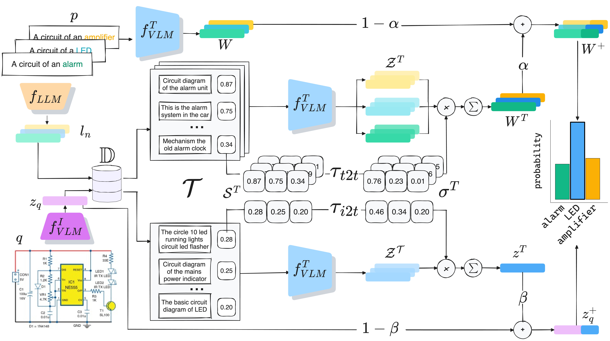

<div align="center">

[](https://arxiv.org/abs/2411.00988)

# Retrieval-enriched zero-shot image classification in low-resource domains

[Nicola Dall'Asen](https://scholar.google.com/citations?user=e7lgiYYAAAAJ), [Yiming Wang](https://scholar.google.com/citations?user=KBZ3zrEAAAAJ), [Enrico Fini](https://scholar.google.com/citations?user=OQMtSKIAAAAJ), [Elisa Ricci](https://scholar.google.com/citations?user=xf1T870AAAAJ)

______________________________________________________________________



</div>
Low-resource domains, characterized by scarce data and annotations, present significant challenges for language and visual understanding tasks, with the latter much under-explored in the literature. Recent advancements in Vision-Language Models (VLM) have shown promising results in high-resource domains but fall short in low-resource concepts that are under-represented (e.g. only a handful of images per category) in the pre-training set. We tackle the challenging task of zero-shot low-resource image classification from a novel perspective. By leveraging a retrieval-based strategy, we achieve this in a training-free fashion. Specifically, our method, named CoRE (Combination of Retrieval Enrichment), enriches the representation of both query images and class prototypes by retrieving relevant textual information from large web-crawled databases. This retrieval-based enrichment significantly boosts classification performance by incorporating the broader contextual information relevant to the specific class. We validate our method on a newly established benchmark covering diverse low-resource domains, including medical imaging, rare plants, and circuits. Our experiments demonstrate that CORE outperforms existing state-of-the-art methods that rely on synthetic data generation and model fine-tuning.

______________________________________________________________________

## Env setup

```bash
python -m venv .core
source .core/bin/activate
pip install -r requirements.txt
```

## Datasets

- [Circuits](https://github.com/xiaobai1217/Low-Resource-Vision)
- [HAM10000](https://www.kaggle.com/datasets/kmader/skin-cancer-mnist-ham10000)
- [iNaturalist](https://github.com/visipedia/inat_comp/blob/master/2021/README.md)

### For database construction

- [CC12M webdataset](https://huggingface.co/datasets/pixparse/cc12m-wds)
- [COYO700M](https://huggingface.co/datasets/kakaobrain/coyo-700m)

### Preprocess datasets

______________________________________________________________________

If you find our research useful, please cite us as:

```
@inproceedings{dallasen2024retrieval,
    title = "Retrieval-enriched zero-shot image classification in low-resource domains",
    author = "Dall{'}Asen, Nicola  and
      Wang, Yiming  and
      Fini, Enrico  and
      Ricci, Elisa",
    booktitle = "Proceedings of the 2024 Conference on Empirical Methods in Natural Language Processing",
    publisher = "Association for Computational Linguistics",
    url = "https://aclanthology.org/2024.emnlp-main.1186/",
    doi = "10.18653/v1/2024.emnlp-main.1186",
}
```

# Website License

<a rel="license" href="http://creativecommons.org/licenses/by-sa/4.0/"></a><br />This work is licensed under a <a rel="license" href="http://creativecommons.org/licenses/by-sa/4.0/">Creative Commons Attribution-ShareAlike 4.0 International License</a>.
